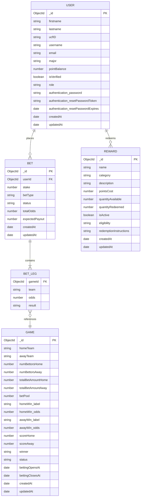

# NitroPicks — Entity Relationship Diagram

## Notes
- `BET_LEG` is an embedded subdocument inside `BET` (not a separate collection)
- `USER.pointBalance` is the single shared balance used for both betting credits and Knight Points — split into `betCredits` / `knightPoints` is pending
- `REWARD` catalog is currently hardcoded; the full seeded catalog (30 rewards) needs to be loaded via `seedRewards.js`
- `GAME.status` transitions: `upcoming → live → finished` or `→ cancelled`
- A `parlay` BET has multiple BET_LEGs (one per game); a `single` BET has exactly one
